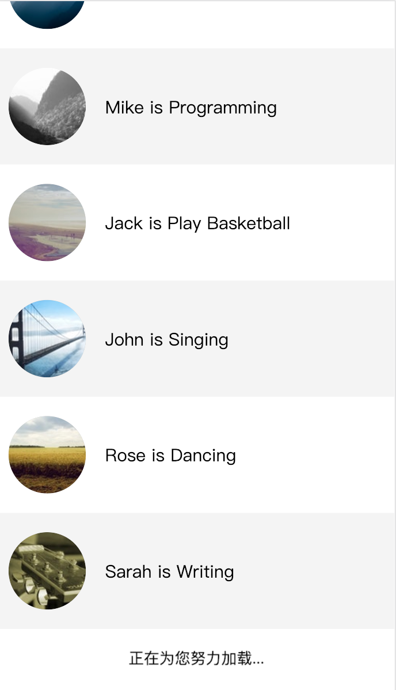
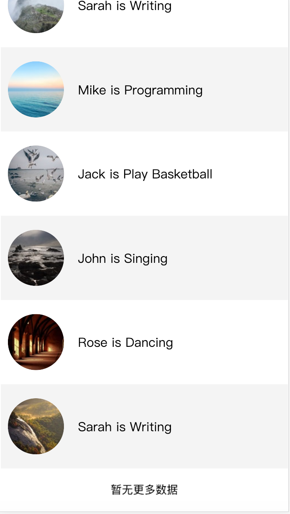

# react-custom-list-view

> A listview component for ReactJS

[](https://www.npmjs.com/package/react-list-view) [](https://standardjs.com)

## Install

```bash
npm install --save react-custom-list-view
```

## Usage

```tsx
import React, { Component } from 'react';

import ReactListView from 'react-list-view';

const totalLength = 100;
let count = 0;

export default class App extends Component {
  state = {
    hasMore: true,
    list: [],
  };

  /**
   * 等待
   * @params time: number(毫秒)
   */
  sleep = time => {
    return new Promise((resolve, _) => {
      setTimeout(resolve, time);
    });
  };

  /*
   * 实际开发过程中调用api获取数据
   * 此处为模拟
   */
  loadMore = async () => {
    if (!this.state.hasMore) return;
    let list;
    if (count >= totalLength) {
      await this.sleep(1000);
      this.setState({
        hasMore: false,
      });
    } else {
      await this.sleep(1000);
      list = [
        {
          text: 'Mike is Programming',
          img: `https://source.unsplash.com/collection/${Math.floor(
            Math.random() * 100,
          )}/100x100`,
        },
        {
          text: 'Jack is Play Basketball',
          img: `https://source.unsplash.com/collection/${Math.floor(
            Math.random() * 100,
          )}/100x100`,
        },
        {
          text: 'John is Singing',
          img: `https://source.unsplash.com/collection/${Math.floor(
            Math.random() * 100,
          )}/100x100`,
        },
        {
          text: 'Rose is Dancing',
          img: `https://source.unsplash.com/collection/${Math.floor(
            Math.random() * 100,
          )}/100x100`,
        },
        {
          text: 'Sarah is Writing',
          img: `https://source.unsplash.com/collection/${Math.floor(
            Math.random() * 100,
          )}/100x100`,
        },
        {
          text: 'Mike is Programming',
          img: `https://source.unsplash.com/collection/${Math.floor(
            Math.random() * 100,
          )}/100x100`,
        },
        {
          text: 'Jack is Play Basketball',
          img: `https://source.unsplash.com/collection/${Math.floor(
            Math.random() * 100,
          )}/100x100`,
        },
        {
          text: 'John is Singing',
          img: `https://source.unsplash.com/collection/${Math.floor(
            Math.random() * 100,
          )}/100x100`,
        },
        {
          text: 'Rose is Dancing',
          img: `https://source.unsplash.com/collection/${Math.floor(
            Math.random() * 100,
          )}/100x100`,
        },
        {
          text: 'Sarah is Writing',
          img: `https://source.unsplash.com/collection/${Math.floor(
            Math.random() * 100,
          )}/100x100`,
        },
      ];
      count += list.length;
      this.setState((prevState, _) => {
        return {
          list: prevState.list.concat(list),
          hasMore: true,
        };
      });
    }
  };

  renderItem = (item, index) => {
    return (
      <div className={'list-item'} key={index}>
        <div className="avatar-container">
          
        </div>
        <div className="title">{item.text}</div>
      </div>
    );
  };

  render() {
    const { hasMore, list } = this.state;
    return (
      <div>
        <ReactListView
          // containerHeight={400}
          loadMore={this.loadMore}
          renderItem={this.renderItem}
          hasMore={hasMore}
          list={list}
          // loadingHint={/* JSX Element */}
          // noDataHint={/* JSX Element */}
        />
      </div>
    );
  }
}
```

## Example

### Loading



### Nomore Data



## License

MIT © [wzhkobe2408](https://github.com/wzhkobe2408)
